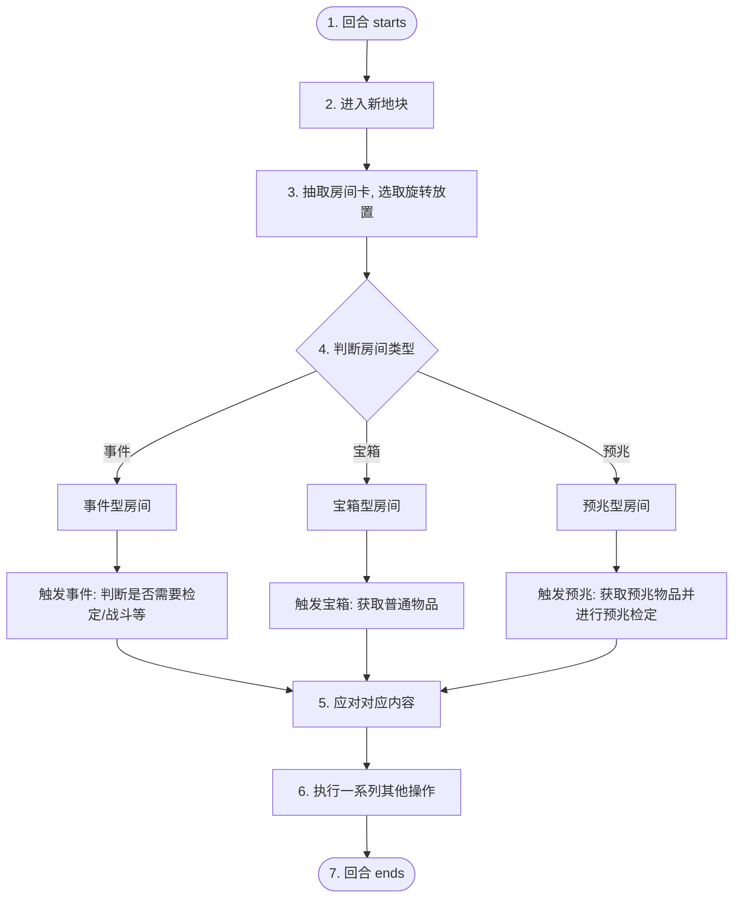
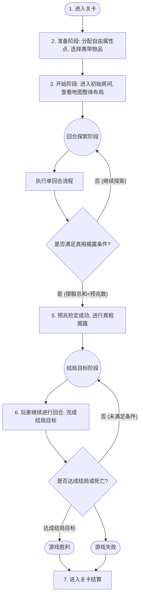

# 策划案

## Content
# 游戏系统与机制

本案中术语暂时参考山屋，后续可根据具体故事背景与叙事进行包装。

## 1. 基本设计思路

以山屋、蓝图王子为蓝本，pvp → pve，设计一个以板块拼接+探索为基础的 rougelike 游戏。

## 2. 游戏核心

玩家通过拼接房间探索未知地图，在事件与预兆中进行检定、获取资源与线索，并在真相揭露后完成最终目标，形成“探索—遭遇—检定—成长—揭露—结局”的核心循环。

## 3. 胜利目标

完成真相揭露后的任务。

## 4. 局内系统

### 4.1. 地图

#### 4.1.1. 玩家角度

一个 n x m 的棋盘格，出生点位于左下角，目标点位于右上角，格子内容需通过探图获知。

#### 4.1.2. 策划角度

一个 n x m 的棋盘格，每个格子是最小单元。棋盘格本由分块的区域组成，区域与区域之间具有可达性，区域内部格子之间也具有可达性，从而保证全局连通，不会出现死局。

2026/5/27 update: 与程序沟通后，由于下图所示想法实现较为麻烦，demo 阶段初始直接生成带出生点与目标点的棋盘格有限大地图即可。防死局需求后期有时间再实现。

#### 4.1.3. 地图背景

综合性医院

### 4.2. 卡牌类型

#### 4.2.1. 房间

* 房间要素
  1. 门数：房间呈四边形，上限4扇门
  2. 门的位置
  3. 类型：事件型房间、宝箱型房间、预兆型房间
  4. 房间名字（叙事包装）
  5. 房间自身效果

#### 4.2.2. 事件（包括战斗）

* 事件主要分为几个区分点：
  * 是否检定数值
  * 检定失败是否有惩罚
  * 检定成功是否有奖励
  * ~~是否获取物品（延迟实现）~~
  * ~~是否产生地图上额外影响（位移玩家？拼接新的地块？地图上产生怪物？）（延迟实现）~~
  * 是否与结局相关
* 战斗属于特殊的检定事件，鉴定失败扣除【生命值】
* 与结局相关的事件根据选择会给一个结局物品，会影响真相揭露时的结局

#### 4.2.3. 宝箱

* 可以获取一个普通物品
* 数量较少

#### 4.2.4. 预兆

* 预兆作为一种检定标准，每当翻出新的预兆时，完成预兆事件后进行预兆数量检定，检定方式为掷骰子，一共掷 x 个骰子，骰子有0、1、2三种点数，当掷出骰子总和小于当前预兆数量时，游戏进行真相揭露（骰子数待定，根据地图大小和期望计算）
* 其余与事件类似，但预兆自带一个预兆物品
* 预兆特殊机制如下：
  * 为确保真相揭露，连续 x 次未触发预兆，下一次翻牌房间类型均为预兆型房间
  * （待定）为避免真相过早揭露，降低前几次掷骰出0的几率 / 直接搞伪随机

#### 4.2.5. 物品（拓展机制，后期细化）

* 通过房间/宝箱/预兆/事件获得
* 道具主要有以下区分点：
  * 是否改变回合资源（本回合属性/房间2抽1→3抽1/储存房间卡牌/……）
  * 是否对地图与房间产生影响
  * 是否使用次数有限
  * 是否干预检定
  * 是否提供更多信息

### 4.3. 回合流程

真相揭露前后回合流程不会改变

1. 回合 starts
2. 进入新地块
3. 抽取房间卡，选取旋转放置
4. 根据房间类型触发 事件/宝箱/预兆
5. 应对对应内容
6. （执行一系列其他操作）
7. 回合  ends

### 4.4. 结局设计

通过 房间名字/位置 与 玩家资源（如结局道具）组合，创造结局的多样性。

* 一点想法
  * 我们希望增加玩家的策略参与，同时降低结局复杂度减少开发成本
  * 考虑同一结局的不同变种，最简单的就是真假结局，稍微复杂一点可以是 HE/NE/BE/OE，期望是有3-4个结局物品/结局线索，根据组合触发结局（可以是一对一也可以是多对一）
  * 预兆物品变为结局物品/结局线索
  * 持有的不同预兆物品对结局难度有不同影响，比如可以给 boss 上 buff or debuff
  * ~~玩家可以自行决定持有的预兆是否需要烧毁，但可能有代价。烧毁后的预兆不再对结局产生影响~~
  * 事件中给的结局物品变为特殊物品，可触发彩蛋（？），增加一点趣味性（x）

### 4.5. 数值检定

* 玩家的【物理】、【精神】两种属性可被检定
* 检定规则遵从山屋，根据被检定的属性数值进行丢骰子（如检定【精神】=6，扔6个骰子），骰子有0-2三种数字，比较最终点数
* 检定失败后的惩罚也遵从山屋惊魂，根据事件描述，可能会扣除对应属性点数、损失物品

### 4.6. 玩家资源

* 属性：有【物理】、【精神】两种属性，初始白板属性设置为 [占位符]。人物数值来源于以下两个部分：
  1. 角色本身的数值，这部分又包含两个来源
     1. 通过科技树升级获得的永久基数
     2. 通过局内事件获取的临时数值
  2. 物品提供的加成
* 【生命值】
* 物品

### 4.7. 关卡流程

1. 进入关卡
2. 准备阶段：分配自由属性点，选择携带物品
3. 开始阶段：进入初始房间，查看地图整体布局
4. 回合开始，回合具体流程见[4.3. 回合流程](https://app.notion.com/p/4-3-36c96d2973ca80a49af4d26ff2c52338?pvs=21)
5. 预兆检定成功，进行真相揭露
6. 玩家继续进行回合，完成结局目标
7. 游戏胜利/失败，进入关卡结算

## 5. 局外系统

### 5.1. 科技树

#### 5.1.1. 可解锁内容

1. 初始可自由分配点数/单项数值的永久提升
2. 初始可携带物品
3. 新的事件？
4. 新的预兆？

#### 5.1.2. 解锁途径

* 通关计算分数给点数，点数用于解锁科技树（参考：明日方舟肉鸽）
* ……

## 6. 当前阶段任务

* （ddl 周六晚12点）编3个房间（1事件1宝箱1预兆），1个事件，3个物品，1个预兆（1组预兆物品），1个大致结局
  * （郁弥）2房间，1事件
  * （SSK）预兆相关+结局

## 可考虑的优化思路

* 走到断头路的时候触发死路保护（强行给一个3通或者4通），触发死路保护时固定给恶性事件
* 如果要说创意点，我觉得修改后的结局相关内容（结局形式&触发方式）可以算是一个创意点？玩法上的创意点我目前只能想到从事件上下功夫，另外的话叙事包装也可以是创意点
